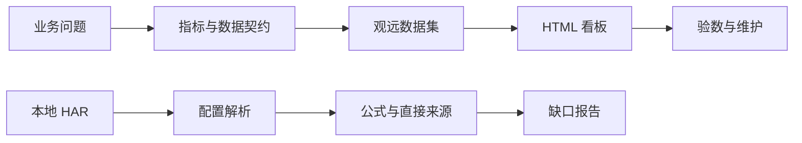

<div align="center">

# 🪐 Guanyuan BI Toolkit

**让看板好看，让数字有出处。**

用 AI 辅助开发，在观远 BI 中展示与管理数据。

`AI Skills` · `HTML BI` · `指标血缘` · `Python 标准库` · `MIT`

[适合谁](#-适合谁) · [应用场景](#-skill-应用场景) · [快速上手](#-五分钟上手) · [与 AI 一起使用](#-与-ai-一起使用)

</div>

---

## 👋 这是什么？

这是一套面向观远 BI 的 AI Skills 与配套工具，帮助你把页面想法变成动态看板，也能把已有看板整理成可读的指标与来源说明。

你可能遇到过这些问题：

- AI 写的页面很好看，接进观远后却不知道数据该怎么喂。
- 一个看板几十张卡片，想弄清指标公式和来源，要逐个打开。
- 字段改了，数据也刷新了，页面为什么还不对？

这个仓库把这些问题拆成两条可以动手跑通的路径。

| 你想做什么 | 从这里开始 | 你会得到什么 |
| :--- | :--- | :--- |
| 做一个动态 HTML 看板 | **HTML BI Starter** | 预览页面、CSS / JS、数据契约和接入说明 |
| 弄清已有看板的指标来源 | **Metric Lineage** | 指标字典、筛选器清单、数据集映射和缺口报告 |
| 让 AI 帮你完成这些工作 | **两套 Skills** | 可复用的工作步骤、证据规则和运行脚本 |

## 🎯 适合谁？

- **已经会用 AI 的数据分析师、BI 开发者**：能用 AI 写 SQL、生成页面，希望进一步接入观远数据集。
- **需要在观远内交付报表的业务与数据团队**：希望提升页面表现力，同时沿用组织现有的数据访问与看板权限管理。
- **接手已有看板的维护者**：需要快速弄清指标公式、筛选器联动和数据集来源。

你不需要从头手写整套前端，但需要能说明业务指标，并具备目标观远环境的数据集或看板操作权限。

## 💡 Skill 应用场景

### 场景一：会用 AI 做页面，也需要通过观远保障数据访问安全

**你已经有 AI 使用基础，希望用自然语言设计报表，但业务数据的查询与展示需要留在组织管理的观远 BI 及其数据环境中。**

这时可以让 AI 根据页面需求、字段说明和模拟数据，辅助设计结果集、生成 HTML/CSS/JS；再把代码接入观远数据集，供团队在已有权限体系内访问。


使用 **[`guanyuan-html-bi-generic`](skills/guanyuan-html-bi-generic/SKILL.md)**，把 AI 辅助开发衔接到观远的展示流程。数据访问范围仍以组织实际配置为准，Skill 负责开发方法与接入适配。

### 场景二：AI 原型已经做好，需要变成持续更新的经营看板

你已经有页面截图或 HTML 原型，希望加入 KPI、趋势、漏斗、排名和范围切换，并随数据集刷新更新。

使用 **HTML BI Skill** 拆解页面模块、明确结果集粒度和字段、固定数据集映射，再生成观远可用的 CSS / JavaScript 与验数说明。

### 场景三：接手一个看板，先搞清楚“这个数怎么算的”

看板里有很多卡片、计算字段和筛选器，逐个打开梳理费时，也容易漏掉关联关系。

使用 **[`guanyuan-metric-lineage`](skills/guanyuan-metric-lineage/SKILL.md)** 在获准环境中解析本地 HAR，生成指标字典、筛选器清单、数据集来源和补采建议，辅助交接、排查与后续改造。运行脚本可直接使用，无需将 HAR 提交给外部 AI；AI 是否读取材料应按组织规则决定。

## ☕ 示例：星际咖啡店

我们用一家不存在的咖啡店演示整个流程：月球站和火星站卖咖啡，老板只想知道订单、销售额和客单价。


页面支持门店切换、每日趋势、空数据和错误状态。不依赖在线字体、图表 CDN 或分析服务。

## 🚀 五分钟上手

### 1. 下载仓库

点击 GitHub 页面上的 **Code → Download ZIP**，解压后打开目录。熟悉 Git 的话也可以：

```bash
git clone https://github.com/hhaoyy/guanyuan-bi-toolkit.git
cd guanyuan-bi-toolkit
```

### 2. 先看一个能跑的页面

双击打开 **`examples/html-bi/index.html`**，无需安装依赖。

在“全部门店 / 月球站 / 火星站”之间切换。页面下方还有空数据、异常数据演示按钮。

接入你的观远环境时，请按 [看板接入指南](docs/html-bi.md) 核对数据结构和平台版本。

### 3. 再试一次指标血缘解析

需要 Python **3.9 或更高版本**，不需要 `pip install`。

```bash
# 生成演示 HAR
python3 scripts/generate_synthetic_har.py

# 解析刚生成的示例
python3 skills/guanyuan-metric-lineage/scripts/analyze_guanyuan_logs.py \
  local/synthetic-cafe.har \
  --output-root output/cafe
```

先打开 **`output/cafe/INDEX.md`**，再看：

| 文件 | 回答的问题 |
| :--- | :--- |
| `synthetic-cafe/docs/metric_lineage.md` | 每个指标来自哪里，在哪一层计算？ |
| `synthetic-cafe/docs/filter_inventory.md` | 筛选器关联了哪些字段和卡片？ |
| `synthetic-cafe/docs/dataset_source_mapping.md` | 数据集绑定了什么表或 SQL？ |
| `synthetic-cafe/docs/coverage_report.md` | 还缺什么配置，要去哪里补采？ |
| `combined_field_lineage.csv` | 能否继续用脚本分析或导入其他工具？ |

示例解析后包含 **2 张卡片、1 个数据集、4 条字段引用**。更多采集方法与支持范围见 [血缘使用指南](docs/lineage.md)。

## 🧭 核心思路



- **先定数据，再写页面。** 字段、粒度、单位和数据集顺序都要明确。
- **数据刷新和结构变更分别处理。** 新增字段后，需要核对数据集结构和卡片绑定。
- **只写证据能支持的结论。** 看见 `SUM(sales)`，不能自动推断完整业务定义。
- **区分直接来源和完整血缘。** SQL 中提取的 `FROM/JOIN` 是追踪线索，不是完整 ETL 血缘。

## 🤖 与 AI 一起使用

两套 Skill 可分别复制到所用 AI 工具的技能目录，也可以让 AI 直接读取仓库内的 `SKILL.md`。第一次使用，可以从下面的任务描述开始。

**从需求到观远看板：**

```text
请按 skills/guanyuan-html-bi-generic/SKILL.md，
帮我做一页需要在观远 BI 中展示的经营看板。

我会提供页面需求、字段说明和模拟数据。
请先确认指标口径、结果集粒度及数据集顺序，
再生成本地预览版、观远 CSS / JavaScript 和接入说明。
业务数据由观远数据集在组织环境内查询和展示。
```

**梳理已有看板：**

```text
请按 skills/guanyuan-metric-lineage/SKILL.md，
在组织允许的本地环境中运行解析脚本，
梳理我指定 HAR 中的卡片、公式、筛选器和数据集来源。
输出指标字典、血缘报告，并说明还缺哪些配置。
```

## 📦 仓库地图

```text
guanyuan-bi-toolkit/
├── examples/html-bi/     # 可直接打开的合成看板
├── skills/               # HTML BI 与指标血缘两套 Skill
├── scripts/              # 示例生成与辅助工具
├── tests/                # 解析与数据适配测试
└── docs/                 # 接入、采集、数据契约
```

## 📚 继续阅读

- [HTML BI 接入指南](docs/html-bi.md)：数据契约、平台适配与常见问题。
- [指标血缘使用指南](docs/lineage.md)：HAR 采集、结果解读与解析范围。

## 🌱 一起改进

欢迎分享使用体验、兼容性问题和通用看板模板。

代码与文档采用 [MIT License](LICENSE)。独立社区项目，与观远官方无隶属或背书关系。

如果它帮你少点开了几张卡片、少追问了一次“这个数哪来的”，欢迎留一颗 ⭐。
