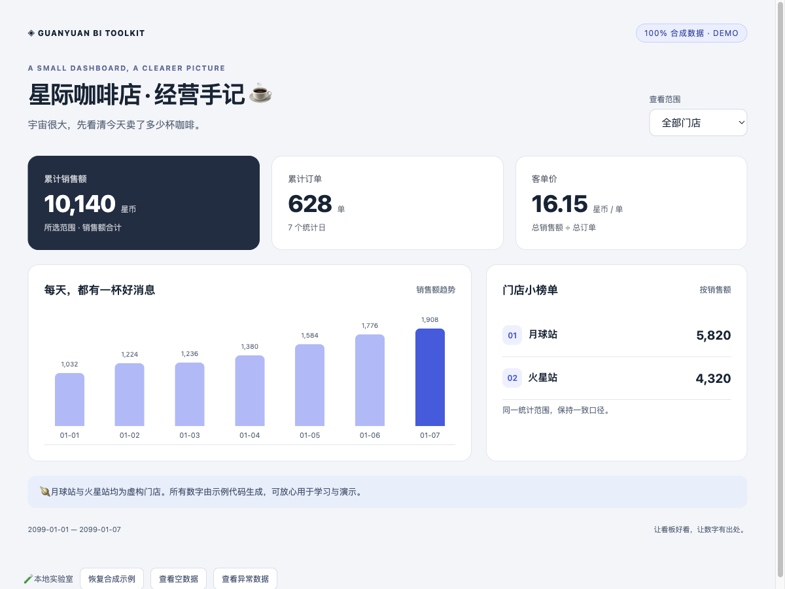
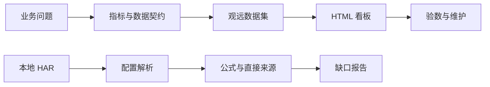

<div align="center">

# 🪐 Guanyuan BI Toolkit

**让看板好看，让数字有出处。**

从 HTML 看板开发，到指标与血缘梳理的一套轻量工具。

`Python 标准库` · `原生 JavaScript` · `本地运行` · `全合成示例` · `MIT`

[快速上手](#-五分钟上手) · [看板接入](docs/html-bi.md) · [血缘指南](docs/lineage.md) · [数据边界](DATA_POLICY.md)

</div>

---

## 👋 这是什么？

你可能遇到过这些问题：

- AI 写的页面很好看，接进观远后却不知道数据该怎么喂。
- 一个看板几十张卡片，想弄清指标公式和来源，要逐个打开。
- 字段改了，数据也刷新了，页面为什么还不对？

这个仓库把这些问题拆成两条可以动手跑通的路径。

| 你想做什么 | 从这里开始 | 你会得到什么 |
| :--- | :--- | :--- |
| 做一个动态 HTML 看板 | **HTML BI Starter** | 预览页面、CSS / JS、数据契约和接入说明 |
| 弄清已有看板的指标来源 | **Metric Lineage** | 指标字典、筛选器清单、数据集映射和缺口报告 |
| 让 AI 帮你完成这些工作 | **两套 Skills** | 可复用的工作步骤、证据规则和运行脚本 |

## ☕ 示例：星际咖啡店

我们用一家不存在的咖啡店演示整个流程：月球站和火星站卖咖啡，老板只想知道订单、销售额和客单价。

**店铺、日期、金额、标识和数据结构实例全部由代码新建，不来自实际业务记录。**



页面支持门店切换、每日趋势、空数据和错误状态。不依赖在线字体、图表 CDN 或分析服务。

## 🚀 五分钟上手

### 1. 下载仓库

点击 GitHub 页面上的 **Code → Download ZIP**，解压后打开目录。熟悉 Git 的话也可以：

```bash
git clone https://github.com/hhaoyy/guanyuan-bi-toolkit.git
cd guanyuan-bi-toolkit
```

### 2. 先看一个能跑的页面

双击打开 **`examples/html-bi/index.html`**，无需安装依赖。

在“全部门店 / 月球站 / 火星站”之间切换。页面下方还有空数据、异常数据演示按钮。

> 本地预览展示的是合成数据。接入你的观远环境时，请使用 [接入指南](docs/html-bi.md)，按实际数据结构和平台版本联调。

### 3. 再试一次指标血缘解析

需要 Python **3.9 或更高版本**，不需要 `pip install`。

```bash
# 从代码生成合成 HAR；不读取任何外部文件
python3 scripts/generate_synthetic_har.py

# 解析刚生成的示例
python3 skills/guanyuan-metric-lineage/scripts/analyze_guanyuan_logs.py \
  local/synthetic-cafe.har \
  --output-root output/cafe
```

先打开 **`output/cafe/INDEX.md`**，再看：

| 文件 | 回答的问题 |
| :--- | :--- |
| `synthetic-cafe/docs/metric_lineage.md` | 每个指标来自哪里，在哪一层计算？ |
| `synthetic-cafe/docs/filter_inventory.md` | 筛选器关联了哪些字段和卡片？ |
| `synthetic-cafe/docs/dataset_source_mapping.md` | 数据集绑定了什么表或 SQL？ |
| `synthetic-cafe/docs/coverage_report.md` | 还缺什么配置，要去哪里补采？ |
| `combined_field_lineage.csv` | 能否继续用脚本分析或导入其他工具？ |

合成示例预期包含 **2 张卡片、1 个数据集、4 条字段引用**。它验证解析流程，不代表所有观远版本均兼容。

## 🧭 核心思路



- **先定数据，再写页面。** 字段、粒度、单位和数据集顺序都要明确。
- **数据刷新和结构变更分别处理。** 新增字段后，需要核对数据集结构和卡片绑定。
- **只写证据能支持的结论。** 看见 `SUM(sales)`，不能自动推断完整业务定义。
- **区分直接来源和完整血缘。** SQL 中提取的 `FROM/JOIN` 是追踪线索，不是完整 ETL 血缘。

## 🤖 与 AI 一起使用

让支持本地 Skills 的 AI 工具读取对应目录，或直接把 `SKILL.md` 作为任务参考：

```text
请按 skills/guanyuan-html-bi-generic/SKILL.md，
以星际咖啡店为例，帮我设计结果集并适配 HTML 看板。
```

```text
请按 skills/guanyuan-metric-lineage/SKILL.md，
解析我指定的本地 HAR，说明已经确认的内容和需要补采的配置。
```

两套 Skill 可分别复制到所用工具的技能目录。使用前先阅读 [数据边界](DATA_POLICY.md)；包含业务信息的材料只应在获准环境中处理。

## 📦 仓库地图

```text
guanyuan-bi-toolkit/
├── examples/html-bi/     # 可直接打开的合成看板
├── skills/               # HTML BI 与指标血缘两套 Skill
├── scripts/              # 合成数据生成、发布文件校验
├── tests/                # 解析与数据适配测试
├── docs/                 # 接入、采集、数据契约
├── DATA_POLICY.md        # 真实数据不进入公开仓库
└── PUBLIC_FILES.sha256   # 审阅文件清单与哈希
```

## 🔒 真实数据不进仓库

本仓库只提供通用代码、重写文档和从零生成的示例。**不接收真实 HAR、业务导出、生产 SQL、客户记录、内部截图或凭据。**

`local/`、`output/`、HAR、CSV 和压缩包默认忽略。发布前还需运行文件清单校验并人工审阅；`.gitignore` 和扫描器都不能代替数据来源确认。详见 [DATA_POLICY.md](DATA_POLICY.md)。

## 🧪 验证与限制

```bash
python3 -m unittest discover -s tests -p 'test_*.py'
node --test tests/dashboard.test.cjs
python3 scripts/check_public_files.py
```

- 解析器处理响应正文中直接包含 `cards` / `dsInfos` 的页面配置。
- 多个不同看板分别解析；`--merge` 只拼接同一看板的采集记录，页面配置选取最完整的一份，不做任意配置冲突合并。
- base64 正文、特殊封装和未覆盖的平台版本可能需要适配。
- 页面是接入起点，尚不构成你的部署环境中的验收结果。
- 独立社区项目，与观远官方无隶属或背书关系。

## 🌱 一起改进

欢迎提交最小可复现的**合成**案例、兼容性说明或通用模板。请勿在 Issue 或 PR 中粘贴实际业务材料。

代码与文档采用 [MIT License](LICENSE)。

如果它帮你少点开了几张卡片、少追问了一次“这个数哪来的”，欢迎留一颗 ⭐。
